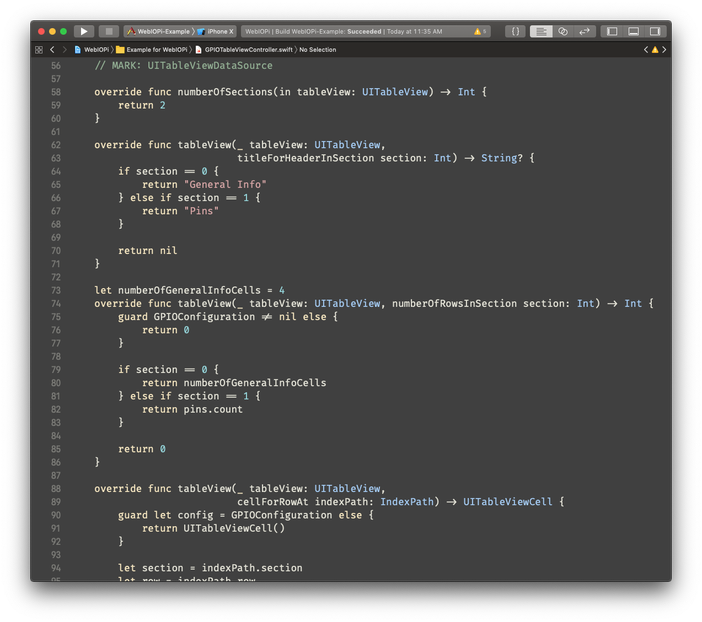

# Zenburn

A fork of Zenburn for Xcode that uses an 18 point ligatured [Fira Code](https://github.com/tonsky/FiraCode) font. Make sure you've installed the Fira Code font.

# Theme Installation

## Scripted

1. Run `./setup.sh`.

## Manual

1. Create folder ~/Library/Developer/Xcode/UserData/FontAndColorThemes/ if it is not there.
2. Copy `Zenburn.xccolortheme` to the folder.
3. Restart Xcode.
